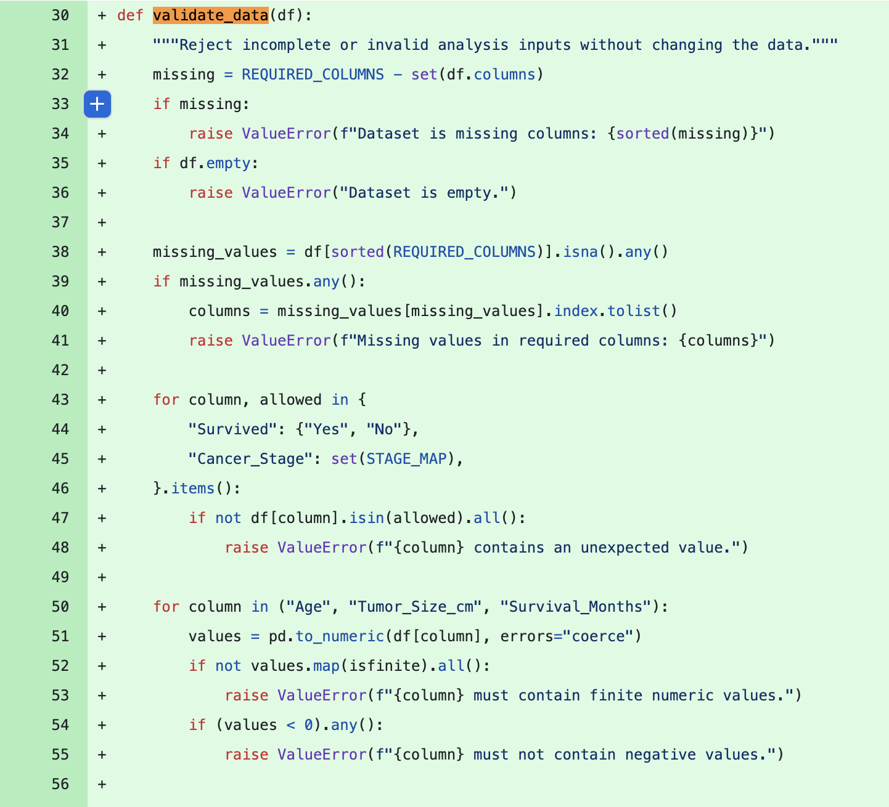
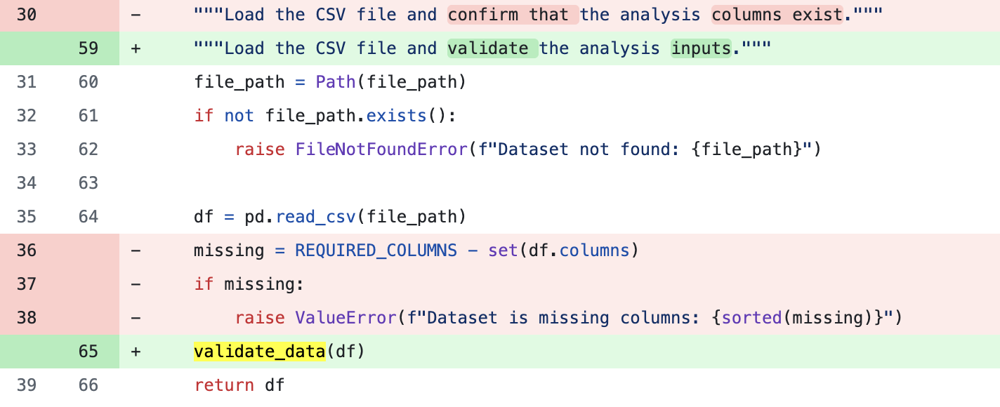
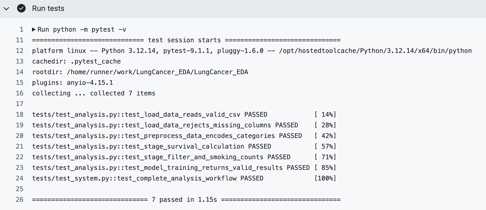
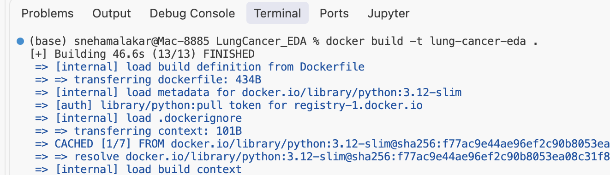
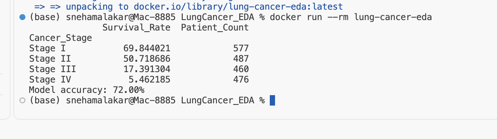

# Lung Cancer EDA and Survival Prediction

[](https://github.com/snehamalakar2000/LungCancer_EDA/actions/workflows/tests.yml)

This project explores a lung cancer dataset and trains a logistic regression model to predict whether a patient survived. It also includes automated unit and system tests so the analysis is reproducible and reliable.

## Project structure

```text
.
├── .github/workflows/tests.yml  # Runs tests automatically on GitHub
├── src/analysis.py              # Reusable analysis functions
├── tests/test_analysis.py       # Unit tests
├── tests/test_system.py         # End-to-end system test
├── EDA.ipynb            # Exploratory analysis and model
├── lung_cancer_dataset.csv      # Dataset included in the repository
└── requirements.txt             # Python dependencies
```

## Analysis

The notebook:

1. Loads and inspects the data.
2. Converts survival and cancer-stage labels to numeric values.
3. Compares survival rates across cancer stages.
4. Examines smoking status for Stage I and Stage IV patients.
5. Measures the relationship between tumor size and survival time.
6. Trains and evaluates a logistic regression model using cancer stage, tumor size, and age.

## Run the project

The dataset is included in the project root. Install the dependencies and open the notebook:

```bash
pip install -r requirements.txt
jupyter notebook EDA.ipynb
```

Run all notebook cells from top to bottom.

## Run the tests

From the project root, run:

```bash
pytest -v
```

The test suite includes checks for data loading, missing columns, preprocessing, stage summaries, filtering, model training, and the complete analysis workflow.

## Continuous integration

The GitHub Actions workflow runs the full test suite whenever code is pushed or a pull request is opened. A successful run confirms that all automated tests pass in a clean Python environment.

## Refactoring and data validation

I extracted the input checks into `validate_data()` so CSV loading and
preprocessing use the same rules. This keeps validation separate from label
conversion and makes errors easier to understand.

The analysis rejects empty datasets, missing required columns or values,
unrecognized survival/stage labels, and nonnumeric, infinite, or negative values
in age, tumor size, and survival months. Missing values in required columns are
reported rather than silently dropped or filled. Missing values in other
columns are not handled by these checks. Numeric strings are converted during
preprocessing. These checks do not remove statistical outliers.

The tests cover invalid inputs, filtering with no matches, and a known-answer
example where one survivor among two patients must give 50% survival.

Verification: run `python -m pytest -v` and rerun the analysis on the included
CSV. 

### Refactoring screenshots

The validation checks now live in a reusable function.



The CSV loader calls this function instead of containing its own checks.



## Earlier test results

The screenshot below shows the original seven unit and system tests passing
through GitHub Actions. The expanded suite should be confirmed in a new run
after these changes are pushed.



### Data Quality and Outlier Treatment

The dataset contains 2,000 records with no missing values or duplicate
rows, so no imputation or duplicate removal was needed.

Using the 1.5 × IQR rule, I flagged 4 potential outliers in age,
8 in tumor size, and 4 in survival duration. These are counts per column
and may include overlapping records.

I retained these observations because being statistically unusual does
not establish that a value is incorrect. Removing them without evidence
could exclude meaningful variation. This check does not confirm the
dataset's clinical validity.

## Key Findings

- The percentage of records labeled as surviving decreased across cancer
  stages: 69.84% in Stage I, 50.72% in Stage II, 17.39% in Stage III,
  and 5.46% in Stage IV.
- The classification model achieved 72% test accuracy, compared with
  62.25% for a baseline that always predicts the most common training
  outcome.
- The model improved accuracy by 9.75 percentage points. This shows why
  comparing a model against a simple baseline is more informative than
  reporting accuracy alone.

These findings describe this dataset and do not establish causation.
The model is exploratory and is not intended for clinical use.

## Analysis Improvement

I added a baseline comparison to check whether the model performs better
than always predicting the most common outcome. Both models use the same
training and test split so their accuracy can be compared fairly.

## Docker

Install and start Docker Desktop, then run these commands from the project folder.

Build the image:

```bash
docker build -t lung-cancer-eda .
```

Run the analysis:

```bash
docker run --rm lung-cancer-eda
```

The container prints survival rates by cancer stage and model accuracy, then exits.

Run the tests inside the container:

```bash
docker run --rm lung-cancer-eda python -m pytest -v
```

All 19 tests passed inside the container.

Docker packages the project with its Python environment and dependencies so it can run consistently across machines.

### Successful build



### Analysis output

